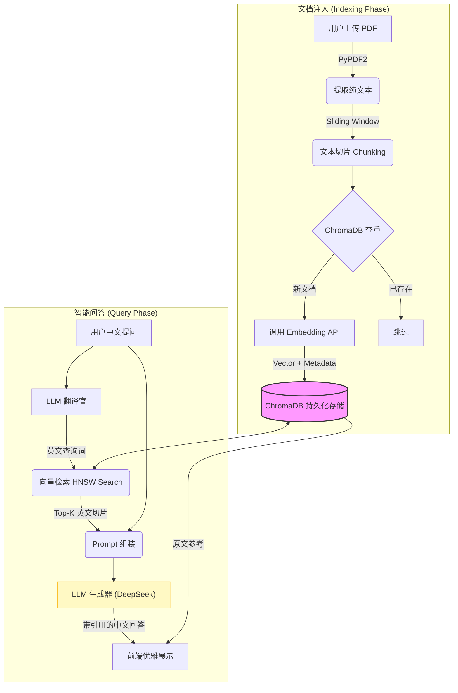

# 🎓 ScholarMind RAG: 深度科研论文知识引擎

A State-of-the-Art, Multi-Document RAG system tailored for academic research, featuring cross-lingual retrieval, precise citations, and a sleek Streamlit UI.

[](https://www.python.org/downloads/)
[](LICENSE)
[](https://platform.deepseek.com/)

---

## 🌟 项目简介 (Introduction)

**ScholarMind RAG** 是专为科研人员打造的本地化知识库问答系统。它不仅是一个简单的聊天机器人，更是一个严谨的科研助手。

本项目解决的核心痛点是：**根据上传中英文献，精确围绕文献进行回答，解决网页版AI的上下文不连贯需要反复注明文献。方便论文综述等写作或者学习**
              

通过将大语言模型（LLM）与专业的向量数据库（ChromaDB）相结合，系统实现了多篇 PDF 文献的持久化存储与极速检索。特别引入的**跨语言查询重写**技术，让用户可以用中文流利提问，系统自动检索英文原文，并返回带有精确引用标注的中文专业解答。

## ✨ 核心特性 (Key Features)

### 🚀 1. 企业级向量数据库存储
废弃了脆弱的 JSON 存储，引入 **ChromaDB** 持久化向量数据库。
* **持久化记忆**：一次上传，永久存储。即使重启应用，之前的文献知识依然在库。
* **秒级检索**：底层采用 **HNSW (Hierarchical Navigable Small World)** 算法，在成千上万个知识切片中实现毫秒级召回。

### 🌏 2. 跨语言语义检索 (Cross-Lingual RAG)
真正意义上打通中英文献鸿沟。
* **Query 重写**：系统自动调用 LLM 将用户的中文提问翻译为精准的英文检索词。
* **语义对齐**：使用多语言 Embedding 模型，最大化中英文向量在空间中的语义相似度，确保找得准。

### 🔍 3. 高可解释性与引用溯源 (Citations)
严谨科研，谢绝瞎编。
* **精准标注**：AI 的回答中会强制生成类似 `[doc 1]`、`[doc 2]` 的引用标记。
* **原文对照**：前端界面提供折叠面板，一键展开即可查看参考的英文原文段落及其相关度评分。

### 🎨 4. 开箱即用的全栈 Web UI
基于 **Streamlit** 构建的高性能交互界面。
* **多文档上传**：支持拖拽上传多篇 PDF 文件，实时构建索引。
* **Session 状态管理**：如同微信聊天般的丝滑多轮对话体验。

---

## 🛠️ 技术架构 (Architecture)

### 业务流程图 (Workflow)

以下是系统内部的数据处理与检索流程图：



## 🚀 快速启动 (Quick Start)

### 1. 克隆项目到本地

```bash
git clone [https://github.com/你的用户名/ScholarMind_RAG.git](https://github.com/WZH032926/ScholarMind_RAG.git)
cd ScholarMind_RAG


### 2. 安装 Python 依赖环境

建议使用 Python 3.9+ 环境。在终端中运行以下命令一键安装所有需要的库：

```bash
pip install -r requirements.txt
```

### 3. 配置环境变量 (关键)

为了保护您的 API Key 不被泄露，本项目使用环境变量管理敏感信息。
请在项目根目录下创建一个名为 `.env` 的文件，并填入您的 API 信息：

```text
# 您的大模型 API Key
API_KEY=your_actual_api_key_here
# API 基础地址 (例如智谱的地址)
#deepseek目前没有embedding模型，建议注册智谱领取免费包，这样一个APIkey就可以同时调用嵌入与对话模型
BASE_URL=[https://open.bigmodel.cn/api/paas/v4/](https://open.bigmodel.cn/api/paas/v4/)
```

### 4. 启动 Web 应用

在终端中输入以下命令启动 Streamlit 服务：

```bash
streamlit run app.py
```

稍后，您的浏览器会自动弹出 ScholarMind 的操作界面（默认地址: `http://localhost:8501`）。